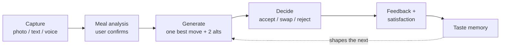
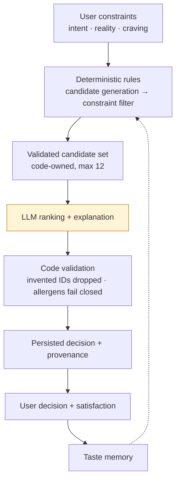
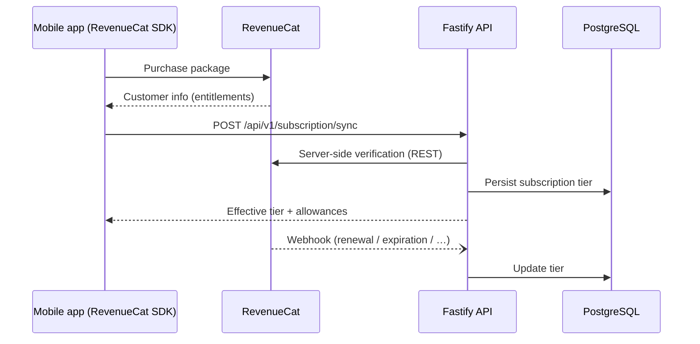
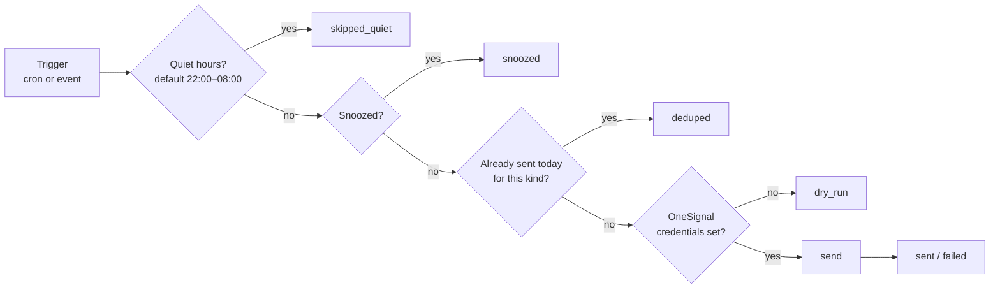

# Meal Rescue — Architecture

The deep technical layer of the repository. The surface layer — what the product is, how to run it, pricing — lives in [README.md](./README.md). Every claim in this document points at the source file that proves it.

> **Snapshot:** verified against source, October 2026. If code and document disagree, the code wins — open an issue.

---

## Contents

1. [Orientation](#1-orientation)
2. [The trust hierarchy](#2-the-trust-hierarchy)
3. [The mobile client](#3-the-mobile-client)
4. [The API layer](#4-the-api-layer)
5. [The engines](#5-the-engines)
6. [The data layer](#6-the-data-layer)
7. [Platform integrations](#7-platform-integrations) — [RevenueCat](#revenuecat) · [OneSignal](#onesignal)
8. [Reliability and verification](#8-reliability-and-verification)
9. [Architectural boundaries](#9-architectural-boundaries)

---

## 1. Orientation

Meal Rescue takes a meal the user already has (photo, text, or voice), applies the user's real-world constraints, and returns **one best improvement plus two alternatives** — or an explicit "keep as is". Every subsequent interaction (decision, satisfaction, household cooking, weekly planning) feeds a context-scoped taste memory that shapes the next recommendation. This document explains how that is built.

### The system on one page

```text
┌──────────────────────────────────────────────────────────────────────┐
│  MOBILE CLIENT — apps/mobile                                         │
│  Expo · React Native · React Navigation · TanStack Query · Zustand   │
│  SDK seams: RevenueCat (entitlements) · AdMob (ads) · OneSignal      │
└───────────────────────────────┬──────────────────────────────────────┘
                                │  JSON / multipart + JWT (Bearer)
┌───────────────────────────────▼──────────────────────────────────────┐
│  API — apps/backend (Fastify, TypeScript)                            │
│  23 route modules → domain services → deterministic engines          │
│  + AI abstraction layer (LLM client with heuristic fallback)         │
└──────┬────────────────┬─────────────────────┬────────────────────────┘
       │                │                     │
┌──────▼──────┐  ┌──────▼──────┐   ┌──────────▼───────────────────────┐
│ PostgreSQL  │  │    Redis    │   │ External services                │
│ Sequelize   │  │ cache, rate │   │ LLM / vision provider            │
│ 36 models   │  │ limits,     │   │ RevenueCat (purchases, webhooks) │
│             │  │ email codes │   │ OneSignal (push)                 │
└─────────────┘  └─────────────┘   └──────────────────────────────────┘
```

### Repository map

| Path | Role |
|---|---|
| `apps/mobile` | Expo / React Native client — 4 tabs, root modals, 9 Zustand stores |
| `apps/backend` | Fastify API — 23 route modules, domain services, deterministic engines, 36 Sequelize models, 72 test files |
| `packages/shared-types` | Pure-TypeScript contract shared by both sides (plus `taste-v2`, `common-table`, `meal-memory`, `taste-journal` modules) |
| `MONETIZATION.md`, `SECURITY.md`, `ARCHITECTURE.md`, `docs/` (superpowers plans & design specs) | Product, monetization, and security documentation |
| `docker-compose.yml`, `railway.toml`, `.github/workflows/` | Local stack, deployment, CI |

### A single rescue, end to end



This loop is the spine of the product. Sections [2](#2-the-trust-hierarchy), [5](#5-the-engines), and [7](#7-platform-integrations) explain each stage in depth; the [RevenueCat](#revenuecat) section explains how the free tier meters it.

**If you have ten minutes:** read §2 (what makes this different), §5.1 (the rescue pipeline), and [RevenueCat](#revenuecat). Those three answer most questions a technical reviewer will have.

---

<a id="trust-hierarchy"></a>

## 2. The trust hierarchy

The core engineering decision: **deterministic code owns constraints, safety, validation, and fallback. The language model ranks and explains.** The model is never asked to enforce a rule — only to order options that code has already deemed safe, and to say why in plain language.



| Stage | Owner | If it fails |
|---|---|---|
| User constraints (intent, reality, craving) | User, resolved by code | — |
| Candidate generation | Code (4 deterministic strategies, max 12 candidates) | Empty set → structured error |
| Hard-constraint filter | Code (`constraint-engine.service.ts`) | Nothing feasible → **422 `CONSTRAINT_CONFLICT`**, never a relaxed constraint |
| Ranking + explanation | **LLM** | Falls back to deterministic weighted scoring (`cold-start-signals.ts`) |
| Final validation | Code (`validation.service.ts`) | Allergen violation → candidate dropped, pipeline fails closed |
| Persistence + provenance | Code | — |

Two rules make this real rather than aspirational:

- **Fail closed on safety.** Allergen checks run in three independent places — the constraint filter before ranking, validation after ranking, and the Common Table AI gate. Any one of them can veto (`apps/backend/src/services/`, proven by `tests/ai-safety-constraint.test.ts`).
- **Invented output is discarded.** The model returns candidate IDs, not content. Unknown IDs are dropped; candidates the model omits are restored with a neutral score. The result always comes from the backend's own solution space (`ranking-engine.service.ts`).

**Provenance** is stored with every AI-backed result as application data, not debug logging: provider, model, prompt version, pipeline version, ranking version, fallback flag, processing time, validation outcome (`Rescue.provenance`, typed by `AIProvenance` in `packages/shared-types`). Prompt versions are pinned constants in `services/ai/prompts.ts`, so a prompt change is observable alongside an app release.

---

## 3. The mobile client

Expo SDK 57 · React Native · React Navigation 7 · TanStack Query (server state) · Zustand (interaction state) · axios (networking).

### Navigation

```text
RootStack
├── Tabs (custom pill tab bar)
│   ├── Rescue      → Home → Capture → MealReview → AiRescue → Feedback
│   │                 (+ Notifications, SatisfactionCheckin)
│   ├── Kitchen     → Kitchen dashboard (+ detail screen)
│   ├── Meal Plan   → week grid + AI composer
│   └── Profile     → preferences, insights, settings, Taste Journal entry
├── Onboarding      → 9-step taste onboarding (pre-tabs for new users)
├── Paywall         → modal (RevenueCat, see §7)
├── Taste Journal   → evidence chapters with dismiss / correct / forget
└── Common Table    → household → ingredients → plan & cook → how did it go
```

Entry point: `apps/mobile/src/navigation/AppNavigator.tsx`.

### Tab workflows (what happens, in order)

**Rescue** — the core loop, `src/screens/HomeScreen.tsx` → `CaptureScreen.tsx` → `MealReviewScreen.tsx` → `AiRescueScreen.tsx` → `FeedbackScreen.tsx`:
1. Home: time-aware primary action, "Cook for the family" (Common Table), kitchen-import consent switch.
2. Capture: camera, library, typed text, or dictation → `POST /api/v1/meal/analyze`.
3. Photo results open an **editable review** — the user confirms what the model saw before anything continues.
4. Recommendation: `POST /api/v1/ai-rescue/generate` renders one best move, reasoning, and alternatives; the user can push back conversationally via `POST /api/v1/ai-rescue/negotiate`.
5. Accept commits `POST /api/v1/rescue/:id/decide` **before** navigating (satisfaction capture requires a committed decision).
6. Feedback: `POST /api/v1/rescue/:id/feedback` with satisfaction + context → feeds taste memory.

**Kitchen** — `src/screens/KitchenScreen.tsx`:
dashboard (`GET /api/v1/kitchen`) → FAB capture (`POST /api/v1/kitchen/capture`) → **editable review modal** (state, quantity, expiry, duplicate handling) → confirm (`POST /api/v1/kitchen/capture/confirm`) → pantry rows → mark used / delete (`/api/v1/pantry/:id/use`, `DELETE /api/v1/pantry/:id`). Natural-language expiry ("tomorrow", "in 3 days") is parsed client-side.

**Meal Plan** — `src/screens/MealPlanScreen.tsx`, state in `meal-memory.store`:
`GET /api/v1/meal-memory/week` → free-text composer (`POST /meal-memory/intent`, clarifications answered via `/confirm`) or AI planner (`POST /meal-memory/ai-plan` → preview → `POST /meal-memory/plan-confirm`) → slot actions (cooked-it `/record-actual`, move, remove, `/feedback`) → dish detail with generated instructions. Plan edits autosave with a 900 ms debounce and rollback on failure. Free-tier locked days open the paywall.

**Profile** — `src/screens/ProfileScreen.tsx`:
parallel loads of `GET /api/v1/user/preferences`, `/insights`, taste bundle; tier card → Paywall; Common Table entry; Taste Journal; reminders toggle; sign-out (wipes all `meal-rescue/*` stored keys).

### State

| Layer | Holds |
|---|---|
| TanStack Query | Server data — week grid, dashboards, journal, preferences (stale time 60 s) |
| Zustand ×9 | `auth`, `monetization`, `decision`, `meal-memory`, `rescues`, `notifications`, `settings`, `common-table`, `paywall-context` |
| AsyncStorage | Session + small flags. Deliberate rule: the session is **cleared on every cold start** (`auth.store.ts`), so each app session re-authenticates |

### Networking

Single axios instance (`src/services/api.ts`): base URL from `EXPO_PUBLIC_API_BASE_URL`, bearer token injected by interceptor, 30 s timeout, and a typed `ApiError` that carries the backend's `code`, `category`, `recoverable`, and `suggestedAction` — so screens can render the server's own recovery hint instead of a generic error. Domain calls are grouped in `src/services/*.api.ts` (one file per domain, mirroring the route modules).

---

## 4. The API layer

Fastify + TypeScript, composed in `apps/backend/src/app.ts`.

### Middleware pipeline (registration order)

```text
Fastify init (logger · x-request-id · trustProxy · 10 MB body limit)
  → CORS → Helmet → Redis → Multipart (10 MB, 1 file)
  → JWT → Rate limit → Swagger → Swagger UI (/docs)
  → onRequest auth hook → error handler → routes (/health + 22 modules)
```

### Authentication

- JWT (HS256, 24 h) with payload `{ sub, email, subscriptionTier }`.
- **One global hook, allowlist-driven**: URLs in `PUBLIC_ROUTES` skip verification; everything else requires a Bearer token. The public list is: `/health`, `/docs`, the six `/api/v1/auth/*` routes, and `/api/v1/webhooks/revenuecat` (which has its own shared-secret check — see [RevenueCat](#revenuecat)).
- Because the hook runs before routing, **anonymous requests to unknown URLs get 401, not 404** — route enumeration is blocked by design, and `tests/error-contract.test.ts` pins this behavior.

### Error contract

Every error is the same shape (`packages/shared-types`, enforced by `middleware/error-handler.ts`):

```json
{
  "success": false,
  "error": {
    "category": "RATE_LIMIT_EXCEEDED",
    "code": "RESCUE_LIMIT",
    "message": "Free rescue limit reached",
    "recoverable": true,
    "suggestedAction": "Watch an ad for extra rescues or upgrade to Pro"
  },
  "requestId": "…",
  "timestamp": "2026-10-02T…Z"
}
```

`category` is an 11-value enum (`INPUT_VALIDATION`, `UNAUTHORIZED`, `FORBIDDEN`, `RATE_LIMIT_EXCEEDED`, `SUBSCRIPTION_REQUIRED`, …). `recoverable` + `suggestedAction` are what the mobile UI actually consumes. Validation failures are Zod errors normalized to 400 `VALIDATION_ERROR` (`middleware/zod-format.ts`); 5xx responses never leak stack traces.

### Rate limiting and allowances (four layers)

| Layer | Rule |
|---|---|
| Global | 100 requests/min per IP, Redis-backed |
| Auth routes | 5 per 15 minutes (brute-force / email-bombing guard) |
| In-process | AI rescue: 10/min per user; paywall teaser: keyed by user/IP |
| Business | Free tier: 3 lifetime rescues → **429 `RESCUE_LIMIT`**; 2 rewarded ads/day → **429 `DAILY_AD_LIMIT`**; 1 added household member → **403 `MEMBER_LIMIT_EXCEEDED`** |

### Route module map (98 endpoints across 23 modules)

| Domain | Module(s) | Endpoints | Scope |
|---|---|---|---|
| System | `app.ts` | 1 | `GET /health` |
| Auth | `modules/auth/` | 6 | check-email, send/verify code, register, login, Google |
| Meal | `meal.routes.ts` | 1 | analyze (multipart image or text) |
| Rescue | `rescue`, `decision`, `feedback`, `satisfaction`, `aftercare` | 7 | generate, decide, feedback, satisfaction (GET/POST), aftercare eligibility/notify |
| AI rescue | `ai-rescue.routes.ts` | 2 | conversational generate + negotiate |
| Kitchen | `kitchen.routes.ts` | 5 | dashboard, identify, what-can-i-make, capture, capture/confirm |
| Pantry | `pantry.routes.ts` | 4 | list, upsert, delete, mark-used |
| Leftover | `leftover.routes.ts` | 1 | alchemist transformations |
| User & taste | `user.routes.ts` | 17 | profile, preferences, insights, account deletion, taste bundle, onboarding, compass |
| Taste journal | `taste-journal.routes.ts` | 12 | chapters, evidence, dismiss/correct/forget, preference profile |
| Household | `household.routes.ts` | 5 | get-or-create, member CRUD |
| Common Table | `common-table.routes.ts` | 6 | converge, session, start, split, complete, feedback |
| Meal memory | `meal-memory`, `plan-review`, `ai-planner` | 23 | intent/confirm, week grid, plan CRUD, rules, feedback, plan-preview/confirm, ai-plan |
| Monetization | `subscription`, `ads`, `paywall`, `webhook` | 6 | sync, ad eligibility/rewards, teaser, RevenueCat webhook |
| Notifications | `notification.routes.ts` | 2 | snooze, test-push |

Validation is Zod (`.safeParse` in handlers; strict schemas on decision-affecting routes). The full runtime reference is Swagger at `/docs`; the shared contract is `packages/shared-types/src/index.ts`. Note: Swagger renders only routes that declare Fastify JSON schemas (currently `/health` + auth) — the table above is the index for everything else.

---

## 5. The engines

Each engine below is presented as a vertical slice: *route → service → deterministic rule → data*.

### 5.1 Rescue pipeline

**Route:** `POST /api/v1/rescue/generate` (`routes/rescue.routes.ts`) → **Service:** `services/rescue-pipeline.service.ts`.

The funnel, in execution order:

1. **Load meal** — detected foods/ingredients from `Meal` (404 if missing).
2. **Resolve intent + reality** — `v2/intent-resolver.ts`, `v2/reality-context.ts` (see below).
3. **Merge onboarding constraints** — dietary restrictions union-merged, religious/cultural notes mapped into avoid-ingredients so nothing is silently lost between onboarding and rescue.
4. **Generate candidates** — `candidate-generator.service.ts`: four deterministic strategies (component additions, cuisine enhancements, minimal substitutions, favorites), max 12, zero network calls.
5. **V2 shaping** — craving lock, intent shaping, `KEEP_AS_IS` injection (intent `PRESERVE`, or the meal is already balanced), `USE_EXPIRING` injection for pantry items expiring soon.
6. **Hard-constraint filter** — `constraint-engine.service.ts`: allergens (fail closed via the ingredient knowledge base), time, budget, cooking allowed, equipment, avoid-list, diet. **Tighten-only: a hard constraint is never relaxed to make a candidate fit.** Empty result → 422 `CONSTRAINT_CONFLICT` with a recoverable suggestion.
7. **Rank + explain** — `ranking-engine.service.ts`: the LLM orders the already-filtered set and writes the user-facing explanation; output is schema-validated, unknown IDs dropped (§2).
8. **Validate** — `validation.service.ts`: last gate; a CRITICAL allergen verdict drops the candidate outright. Product rule: **one recommendation + at most two alternatives**.
9. **Persist** — `Rescue` row with intent, decision action, `v2Context`, provenance, and processing time; journey events written to `DecisionEvent`.

**Two server entry points exist by design:** `/api/v1/rescue/generate` (the deterministic pipeline above) and `/api/v1/ai-rescue/*` (a conversational generate/negotiate surface with its own in-process rate limit). The current mobile loop drives the conversational surface; the full pipeline is implemented, route-exposed, and covered by `tests/integration/pipeline.integration.test.ts`.

### 5.2 The V2 decision layer (`services/v2/`)

- **Intent** — `SATISFY | PRESERVE | LIGHTEN | NO_COOK | DECIDE`, default `DECIDE`. The resolver's contract: *never infer emotion or mood; only interpret an explicit stated intent* (`intent-resolver.ts`).
- **Reality** — a **hard filter, not a preference** (`reality-context.ts`): time window (5/15/30 min) and cooking-allowed tighten constraints and can never loosen them; budget ranks tighten-only; cleanup tolerance is explicitly a *ranking nudge*, not a filter.
- **Craving lock** — a stated craving marks one candidate as locked; no later stage may remove or replace it (`craving-lock.ts`).
- **Decision engine** — pure code: decorates every candidate with action type (`RESCUE | ADD | COMBINE | USE_LEFTOVER | USE_EXPIRING | KEEP_AS_IS`), estimated time/cost, intent and reality satisfaction, and nutrition rationale (`decision-engine.service.ts`).
- **Satisfaction & aftercare** — `POST /rescue/:id/satisfaction` (`EXACTLY | ALMOST | NOT_REALLY`) with explicit feedback weighted double over passive history; aftercare check-in requires a `MEAL_COMPLETED` event, one push per rescue, 30-minute cooldown (`aftercare.service.ts`).

### 5.3 AI abstraction (`services/ai/`)

```text
Domain service → LlmClient interface
                    ├─ OpenAiLlmClient   (provider adapter: retries, strict JSON/zod)
                    │      └─ wrapped by ResilientLlmClient (timeouts → fallback)
                    └─ HeuristicLlmClient (deterministic, zero network)
```

- **Selection happens once**, in `services/composition.ts`: an API key selects the provider-backed client wrapped in the resilient wrapper; no key selects the heuristic client outright. Domain services never import a provider SDK.
- **Vision cache** — `vision.service.ts`: key = `sha256(imageBytes)` plus an optional contextual hint; Redis, 24-hour TTL; images are resized with sharp before encoding to cut tokens.
- **Prompt versions** (pinned in `prompts.ts`): `v3.0-food-recognizer`, `v1.0-kitchen-analyzer`, `v2.0-mr1` (text extraction), `v2.1-mr2` (ranking).
- **Heuristic fallback is not a mock LLM** — it runs the same deterministic scoring (`ranking/cold-start-signals.ts`) so a provider outage degrades ranking quality, never product behavior.

### 5.4 Taste and personalization

Two coexisting systems, both context-scoped:

| | Affinity memory | Taste Journal |
|---|---|---|
| Store | `TasteMemory(ingredient, contextType, contextValue, affinity ∈ [-1,1], confidence)` | `TasteSignal` ← `TasteSignalEvidence` rows |
| Update rule | Count-decayed learning rate: `new = old×(1−w) + evidence×w`, `w = weight/(1 + count×0.35)`, clamped to `[-1,1]` (`meal-completion.service.ts`) | Evidence aggregation: polarity by 60% majority, conflict at 30% minority, status ladder `STILL_LEARNING → EMERGING → ESTABLISHED` (`taste-signal.service.ts`) |
| Idempotency | Event-sourced via `TasteEvent` | `sourceEventKey` unique per evidence row — duplicate evidence is a no-op |
| User control | Feedback-driven only | Chapters with **dismiss / correct / forget** overrides (`taste-journal.routes.ts`) |

- **Cold start** is handled by `ranking/cold-start-signals.ts`: pure, DB-free weighted-additive scoring (weights sum to 1) plus a safety gate and an anti-fatigue layer that penalizes repeating the same addition role-family (protein / crunch / fibre) across recent rescues.
- **Anti-fatigue** counters live in `TasteExposure` (recent recommendations, consecutive exposure) and are read by the pipeline's `recentlyShownAdditions()`.
- The journal performs a **one-time, idempotent backfill** (gated by `TasteJournalMeta`) that replays historical taste events, cuisine affinities, and onboarding answers into signals — with forgotten strands never revived.

### 5.5 Meal planning (`services/meal-memory/`)

- **Intent classification is deterministic** — a regex rule table (`intent-classifier.ts`), confidence bands (HIGH ≥ 0.75), and a hard rule: *destructive intents always require confirmation regardless of confidence*. No LLM in the path.
- **Planning engine** (`planning-engine.ts`): candidate generation → safety filter → exposure + household-rule scoring → greedy slot assignment → shortfall detection → inventory allocation → persist. Strategies: `balance | easy | use_expiring | family_favorites`. `previewMode` computes a full plan without writing state.
- **Inventory is HOLD semantics** — `InventoryReservation` subtracts reserved quantity while active; rule deactivation releases; expired reservations are swept (`accounting.service.ts`).
- **The AI planner is the one deliberate exception to graceful degradation**: `ai-planner.service.ts` surfaces errors to the user instead of silently falling back (≤3 plan days per turn, ≤3 clarifying questions). The deterministic engine remains reachable explicitly.

### 5.6 Common Table (`services/common-table/`)

One household, several constraints — a convergence problem, not a vote:

1. **Member safety filter runs before scoring** — unsafe ingredients never receive a score; an unknown ingredient is unsafe when any member declares an allergy (`household-constraint.service.ts`).
2. **Template convergence** over a cooking graph (bowl, stir-fry, pasta, skillet, platter) — **branch as late as possible**: maximize the shared base, split only where a member's constraint forces it (`convergence-engine.service.ts`).
3. **Honest fallback** — if no template converges, the system says so rather than fabricating "one meal for everyone".
4. **AI is post-validation polish only** — `common-table-ai.service.ts` runs after a deterministic plan exists: Zod schema → safety gate → blocked ingredients stripped → if unsalvageable, returns `null` and the caller uses the deterministic engine. Name polishing re-checks output against blocked ingredients and reverts violations.

### 5.7 Kitchen and pantry intelligence

Capture (`CAMERA | PHOTO | MANUAL`) → LLM proposes structured items → **user reviews and confirms** → pantry rows (`kitchen-capture.service.ts`). Two details make it reliable: free text is canonicalized against a knowledge-base alias map before storage (`pantry.service.ts: canonicalizeIngredientName`), and when LLM output is unusable a deterministic text parser takes over (`parseTextFallback`). Food states: `fresh | opened | leftover | use_soon | gone`. "What can I make?" and camera identification run on the vision provider with deterministic local fallbacks (`kitchen-intelligence.service.ts`).

---

## 6. The data layer

36 Sequelize models in `apps/backend/src/database/models/`, snake_case columns, `onDelete: CASCADE` on user-owned foreign keys, associations declared in `models/index.ts`.

| Group | Models | Carries |
|---|---|---|
| Core (6) | `User`, `Meal`, `Rescue`, `Feedback`, `Preference`, `Pantry` | Accounts, analyzed meals, rescue records with provenance, learned preferences |
| Taste V2 (6) | `TasteMemory`, `TasteEvent`, `TasteExposure`, `TasteCombination`, `TasteSensoryPreference`, `TasteTreatmentPreference` | Affinity rows, the event log, anti-fatigue counters, sensory beliefs |
| Taste Journal (6) | `TasteSignal`, `TasteSignalEvidence`, `TasteInsightOverride`, `TasteJournalMeta`, `FeedbackJournalNote`, `UserTastePreferences` | Evidence → signal aggregation, user overrides, backfill gate |
| Decision (3) | `DecisionEvent`, `SatisfactionRecord`, `AdditionEvent` | Append-only journey ledger (`INTENT_SELECTED → … → MEAL_COMPLETED`), satisfaction, onboarding A/B answers |
| Household (7) | `Household`, `HouseholdMember`, `HouseholdPreference`, `SharedMeal`, `SharedMealMember`, `TableOutcome`, `TableEvent` | Members with constraints, shared-meal plans and lifecycle |
| Meal Memory (6) | `MealMemoryEvent`, `MealPlan`, `MealEvent`, `MealRule`, `InventoryReservation`, `MealInventoryAllocation` | Intent audit trail, weekly plans, slots, rules, HOLD reservations |
| Infra ledgers (2) | `RescueCreditGrant`, `NotificationLog` | Idempotency records (below) |

**Ledgers that make operations idempotent:**

| Ledger | Unique key | Safe against |
|---|---|---|
| `RescueCreditGrant` | `adTransactionId` | Double-granting ad rewards on retried claims |
| `NotificationLog` | `userId + kind + dayKey` | Duplicate pushes; also stores snooze (`suppressedUntil`) |
| `TasteSignalEvidence` | `sourceEventKey` | Double-counting the same evidence |
| `TasteJournalMeta` | one row per user | Running the journal backfill twice |

Schema management is Sequelize `sync({ alter: true })` — a development strategy; a migration runner is the planned production path ([§9](#9-architectural-boundaries)).

---

## 7. Platform integrations

This chapter covers the two third-party platforms the product depends on at runtime. Pricing strategy and unit economics live in [MONETIZATION.md](./MONETIZATION.md); secrets, auth hardening, and privacy live in [SECURITY.md](./SECURITY.md).

### RevenueCat

**Design rule: the client may display a tier; only the backend decides one.** RevenueCat is the purchase and entitlement layer — the Fastify API confirms entitlement server-side and owns every allowance.



**The entitlement model**

- Client: RevenueCat SDK, entitlement `mealrescue_pro`; packages fetched live, static price labels only as fallback (`apps/mobile/src/services/revenuecat.service.ts`, `PaywallScreen.tsx`).
- `POST /api/v1/subscription/sync` verifies against the RevenueCat REST API (`REVENUECAT_API_KEY`); a client-supplied verdict is only accepted when `REVENUECAT_ALLOW_CLIENT_ENTITLEMENT` is explicitly set.
- `POST /api/v1/webhooks/revenuecat` — public route protected by a timing-safe comparison of `REVENUECAT_WEBHOOK_SECRET` (not JWT). Grant events: `INITIAL_PURCHASE`, `RENEWAL`, `PRODUCT_CHANGE`, `UNCANCEL`; revoke events: `EXPIRATION`, `CANCELLATION`, `BILLING_ISSUE`. The endpoint always acknowledges so RevenueCat's retry machinery is never punished.
- **Effective tier** = paid subscription **or** a live 1-hour Pro Pass: `effectiveTier()` in `services/rescue-allowance.service.ts`.

**Where free-tier ceilings are enforced (all backend, all tested):**

| Ceiling | Enforcement point | Response |
|---|---|---|
| 3 lifetime rescues (counted from account creation, never resets) | `consumeRescueAllowance()` called before the pipeline runs (`routes/rescue.routes.ts:83`) | **429 `RESCUE_LIMIT`** + suggested action (watch ad / upgrade) |
| 2 rewarded ads per local day | `ads.routes.ts` | **429 `DAILY_AD_LIMIT`** |
| 1 added household member | `household.routes.ts` | **403 `MEMBER_LIMIT_EXCEEDED`** |
| 1 full plan day | `plan-preview.service.ts` | `PLAN_LIMIT_EXCEEDED` (client shows an upgrade banner) |
| Ads never shown to Pro | `requireFreeUser()` on ad routes | 403 `ADS_NOT_ELIGIBLE` |

**Rewarded ads (AdMob) are idempotent by construction:** the client reports an `adTransactionId`; `grantCredits()` inserts into `RescueCreditGrant` and returns `granted: false` on any replay (`GET /api/v1/ads/eligibility` exposes remaining eligibility). Grants: `AD_REWARD_CREDITS` (default 2) or `PRO_PASS_MINUTES` (default 60).

**Failure modes, by design:** blank keys → purchases disabled and static pricing rendered (fresh clones work); Expo Go → RevenueCat Preview API Mode (mocked purchases; real flows need a development build); verification outage → structured 502 `REVENUECAT_API_ERROR` / 503 `REVENUECAT_NOT_CONFIGURED`.

**Verify it in the repo:** `tests/webhook.test.ts`, `tests/integration/webhook.integration.test.ts`, `tests/integration/ads-rewards.integration.test.ts`, `tests/integration/allowance.integration.test.ts`, `tests/paywall-teaser.*.test.ts`.

### OneSignal

**Design rule: a notification is earned, not sent.** Every push passes one funnel before leaving the server.



The funnel (`services/notifications/notification.service.ts`) checks, in order: **quiet hours** (user-local, per-user overrides) → **snooze** (`NotificationLog.suppressedUntil`) → **dedupe** (unique `userId + kind + dayKey`) → **dry-run** (no credentials ⇒ logged, nothing sent) → **send**. Every outcome is recorded so behavior is observable, not assumed.

**What gets sent**

| Campaign | Scheduler / trigger | Gate |
|---|---|---|
| Spoiler Alert (expiring food) | Cron, looks 48 hours ahead, ≤50 users per tick | One push per user per local day; items used in the last 24 h excluded |
| Aftercare check-in ("Did that hit the spot?") | Fired after `MEAL_COMPLETED` | Requires committed decision, 30-min cooldown, **max one per rescue**, respects `feedbackEnabled` |
| Meal-memory reminders | Cron (started in `server.ts` only when credentials exist) | Quiet hours + dedupe as above |

- **Copy quality is bounded, not trusted:** push title ≤ 40 chars, body ≤ 90 chars, enforced by a Zod gate; an LLM may write the copy, but a hand-written template ships if the model fails or breaks the length contract (`copywriter.service.ts` — no guilt-tripping, no health claims, no clickbait).
- **Client side** (`onesignal.service.ts`): initialized only when `EXPO_PUBLIC_ONESIGNAL_APP_ID` is set; notification permission is requested **after the first rescue**, not at launch. Action buttons are real product surface — `later` (4 h snooze), `not_tonight` (24 h), `loved_it / was_ok / not_great` (records satisfaction directly), `make_it` (deep link). Deep links use the `mealrescue://` scheme and resolve to app routes.
- **In-app inbox** mirrors every push (`notifications.store`, 30-entry cap, 30 s dedupe) with per-kind snooze via `POST /api/v1/notifications/snooze` — a push that missed its window is still readable.
- **Dry-run mode** means the integration is inspectable in any environment: with credentials absent, the full pipeline runs and logs what *would* be sent.

**Verify it in the repo:** `tests/integration/notifications.integration.test.ts`, `tests/integration/spoiler-alert.integration.test.ts`, `tests/aftercare-notification.service.test.ts`.

---

## 8. Reliability and verification

### Graceful degradation is a feature

One rule, applied at every seam: *if the provider fails, ship the deterministic result — never drop the feature.*

| Seam | Primary | Fallback |
|---|---|---|
| Candidate ranking | LLM | Deterministic weighted scoring (`cold-start-signals.ts` via `HeuristicLlmClient`) |
| Any text completion | OpenAI-compatible client | `HeuristicLlmClient` — zero network, selected at startup when no key exists |
| Common Table naming | LLM polish | Deterministic plan stands alone; AI output re-validated and reverted on violation |
| Push copy | LLM | Hand-written templates within the same length contract |
| Kitchen identify / what-can-i-make | Vision provider | Local deterministic fallbacks |
| Meal-plan clarification | LLM (`AiPlannerService`) | **Deliberate exception:** errors surface to the user ([§9](#9-architectural-boundaries)) |

### Verification

```bash
npm run lint && npm run typecheck && npm test && npm run build
npm run test --workspace @meal-rescue/backend      # Jest, serial
```

- **Run it:** `docker compose up -d` starts PostgreSQL 15, Redis 7, and the API on port **3010** (Swagger at `/docs`, health at `/health`); the mobile client points at it via `EXPO_PUBLIC_API_BASE_URL`.
- **Deploy:** Railway builds `apps/backend/Dockerfile` and gates deploys on the `/health` endpoint (`railway.toml`).
- **CI** (`.github/workflows/ci.yml`): lint → typecheck → backend tests against a real `postgres:15` service → backend build → Expo Doctor for mobile.
- **72 backend test files**, of which the DB-backed integration suites activate only when `TEST_DATABASE_URL` is set (CI supplies it; local runs skip them cleanly).
- Tests assert **behavioral contracts**, not line coverage: `ai-safety-constraint` (the model cannot bypass hard constraints), `security-surface` (every protected route 401s; no stack traces leak), `security-cross-user` (tenant isolation), `common-table-convergence` (hard constraints never relaxed), `error-contract` (401 before 404), plus monetization idempotency and allowance suites.
- Coverage thresholds are enforced in `jest.config.js` (statements/lines 60, branches/functions 50).

---

## 9. Architectural boundaries

Stated as decisions with reasons, so the picture is honest rather than aspirational:

1. **Schema management is `sync({ alter: true })`, not migrations.** Correct for a fast-moving pre-production codebase; a migration runner is the planned production path before real user data matters.
2. **The AI planner does not silently degrade.** Everywhere else a provider failure ships a deterministic result; for conversational planning, surfacing the error was judged better than a confidently wrong plan (`ai-planner.service.ts`).
3. **Swagger documents only schema-declared routes.** Most handlers validate with Zod in code rather than Fastify JSON schemas, so `/docs` shows 7 of 98 endpoints — the module map in §4 is the index, and `packages/shared-types` is the full contract.
4. **Two packages are placeholders.** `packages/ai-pipeline` and `packages/ui-components` are unwired scaffolding; the real pipeline lives in `apps/backend/src/services/ai/` and the real UI in `apps/mobile/src/components/`.
5. **Cross-cutting depth lives elsewhere by design:** monetization economics in [MONETIZATION.md](./MONETIZATION.md), security and privacy detail in [SECURITY.md](./SECURITY.md).

---

*A better meal does not always require a new meal.*
