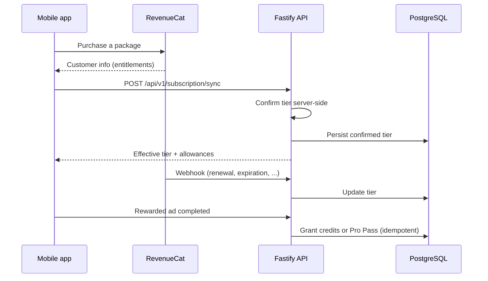

# Paywall & Monetization Deep Dive

> Companion to the [Monetization & RevenueCat](README.md#monetization--revenuecat) section of the README. This document explains **the curiosity hook that opens the screen, what is sold, where the paywall appears, how RevenueCat and the backend divide responsibility, and how to test it.**

**Contents:** [1 Summary](#1-summary) · [2 The curiosity hook](#2-the-curiosity-hook) · [3 The offer](#3-the-offer) · [4 Paywall design](#4-paywall-design) · [5 Where the paywall appears](#5-where-the-paywall-appears) · [6 Architecture and trust model](#6-architecture-and-trust-model) · [7 RevenueCat integration reference](#7-revenuecat-integration-reference) · [8 Environments and testing](#8-environments-and-testing) · [9 Unit economics](#9-unit-economics) · [10 Risks and mitigations](#10-risks-and-mitigations) · [11 Experiments to run next](#11-experiments-to-run-next) · [12 File map](#12-file-map)

---

## 1. Summary

| | |
|---|---|
| **What is sold** | Removal of usage ceilings: unlimited AI rescues, a full week of Meal Plan, unlimited household members. |
| **Plans** | Monthly $4.99 · Yearly $39.99 · Lifetime $79.98 |
| **Revenue streams** | Subscriptions (monthly, yearly) · one-time lifetime purchase · rewarded ads (AdMob) that grant credits or a short Pro Pass |
| **RevenueCat's role** | Purchase flow, entitlement state, and subscription lifecycle events (SDK, sync, webhooks) |
| **Backend's role** | Owns allowances, credit grants, and every gate. The client is never trusted. |
| **Core principle** | Meter the expensive, repeatable action (AI rescues) and the multi-day or multi-person extensions; leave a no-card path to try Pro. |

**Why these gates and not others.** Two gates follow cost: every AI rescue and every AI plan day invokes a model, so metering them bounds a real per-request expense. The third does not — adding a household member costs no compute, and it is gated for *scope* instead (multi-tenant data, and allergies recorded per member are treated as hard safety rules). The limits were originally daily (`rescuesPerDay` in the August plan) and were later changed to **per-account lifetime**, which moves the rescue ceiling away from being a cost control: because ads make credits renewable, the base allowance is a conversion device, not a spend cap. That is what the "attention can substitute for payment" note below means.

---

## 2. The curiosity hook

A paywall that opens with a price list sells. This one opens with a memory.

Before a single plan or price is shown, the Pro screen greets the user with a meal of their own — the rescue they marked *loved*. Two beats, and the second one deliberately never delivers:

| Beat | Copy (in the app today) |
|---|---|
| **Remember** — the opener | *"You loved what the curd did with pomegranate and roasted peanuts!"* |
| **Withhold** — the hook | *"The next combination might leave you craving another bite."* |

1. **Remember.** The opener mirrors a pleasure the user already had — the exact dish they rated *loved*, written back to them. Nothing generic ever appears here: the copy is derived from their own rescue record, so it could not have been shown to anyone else.
2. **Withhold.** The hook asserts that something better is waiting and refuses to show it. The promised thing is named, never revealed — so the only way to close the loop is to tap through, and tapping through lands on the paywall.

That gap, between what is remembered and what is only promised, is the engine: curiosity makes the next step feel *inevitable* rather than *sold*. The user is not asked whether they want Pro; they are shown the edge of something they already want and left to lean into it.

The copy is **deterministic-first by design** — rendered instantly from local pools, so the paywall never opens blank and never waits on a spinner — with an AI variant of the same two-beat structure (subject-scoped, cached for three hours, signature-bound so stale copy never outlives its subject) ready behind `PAYWALL_AI_TEASER_ENABLED`. Wiring: [`usePaywallTeaser.ts`](apps/mobile/src/hooks/usePaywallTeaser.ts) and [`paywall.api.ts`](apps/mobile/src/services/paywall.api.ts), which calls `POST /api/v1/paywall/teaser` ([`paywall.routes.ts`](apps/backend/src/routes/paywall.routes.ts)).

---

## 3. The offer

### Plans

| Plan | Price | Billing | Arithmetic from list prices |
|---|---|---|---|
| Monthly | $4.99 | per month | 12 × $4.99 = $59.88 per year |
| Yearly | $39.99 | per year | ≈ $3.33/month; ≈ 33% below twelve monthly payments |
| Lifetime | $79.98 | once | 2.0 × the yearly price; ≈ 16 months of monthly |

Live prices come from the store through RevenueCat once keys are configured. The static labels above appear only as a fallback when store packages are unavailable.

### Free allowance

These are **one-time totals per account** and never refresh:

| Allowance | Amount | Next step when exhausted |
|---|---|---|
| AI rescues | 3 for the lifetime of the account | Pro, an ad-earned credit, or the free Pro Pass |
| Meal Plan | 1 plan day for the entire time (day 1 of the first plan) | Day 2 of any plan requires Pro |
| Cook for the Table | 1 added household member | Each additional member requires Pro (`MEMBER_LIMIT_EXCEEDED`, HTTP 403) |

**One plan day. One seat at the table. Three rescues.** The free tier is singular on purpose — a single day of Meal Plan, a single added member, three AI rescues for the life of the account: enough to prove the loop end-to-end, never enough to live inside it. Exactly one thing renews, and it costs attention rather than money — the two daily rewarded ads.

### Ad-earned allowance (the only renewable source)

| Rule | Value |
|---|---|
| Rewarded ads per day | 2 (cap resets at local midnight) |
| Reward per ad | **+2 rescue credits** (`AD_REWARD_CREDITS`) *or* a **60-minute Pro Pass** (`PRO_PASS_MINUTES`) |
| Credit expiry | Credits never expire |
| Idempotency | Ad reward transactions are idempotent |

**Effective ceiling for a free user:** the 3-rescue base allowance does not refresh, but ads can add up to 4 credits per day (2 ads × 2 credits) if every ad is taken as credits. So the "3 lifetime rescues" figure is the *base*, not the maximum. This is intentional: attention can substitute for payment, and Pro removes the need to choose.

---

## 4. Paywall design

  

- **Three plans, three commitment levels.** A low-commitment monthly plan, a discounted yearly plan, and a one-time lifetime plan for people who dislike subscriptions.
- **A no-card alternative.** The free 1-hour Pro Pass lets someone feel Pro before paying.
- **Rejected confirms do not hijack the screen.** A plan-limit rejection shows an inline banner with an upgrade hint and leaves the decision to the user.

- **Custom-built screen, not RevenueCat's Paywalls UI.** Packages are fetched through the SDK (`getOfferings()` → `offerings.current`, [`revenuecat.service.ts:146-158`](apps/mobile/src/services/revenuecat.service.ts)) and rendered by this app's own [`PaywallScreen`](apps/mobile/src/screens/PaywallScreen.tsx). Copy, layout, and badges are ours; only prices and availability come from RevenueCat.
- **No plan is pre-selected.** There is no default or remembered choice — the user taps to select, so nobody buys by accident. The only signal is a **"Best value" badge and highlighted card on the yearly plan** (`recommended = plan === 'yearly'`, `PaywallScreen.tsx:349`), which is a recommendation rather than a pre-selection.
- **Restore purchases is present** (button and `handleRestore`, `PaywallScreen.tsx:212,423`) — required for subscription apps and reachable from the same screen.
- **A rejection never traps the user.** A failed limit shows an inline banner with an upgrade hint and leaves the screen intact — no forced modal.

---

## 5. Where the paywall appears

| Trigger | What happens |
|---|---|
| Rescue allowance exhausted (3 lifetime rescues used, no credits) | The next rescue needs Pro, an ad-earned credit, or the free Pro Pass. |
| Meal Plan beyond day 1 | Pro is required. A rejected plan confirm (`PLAN_LIMIT_EXCEEDED`) shows an inline error banner with an upgrade hint; it does **not** auto-open the paywall. |
| Adding a second household member | Backend returns `MEMBER_LIMIT_EXCEEDED` (403). |
| Direct entry | `Paywall` is a root-level screen; Profile surfaces current subscription state. |

Every path below is reachable today. All Common Table paths pass `{ minimal: true }`, which renders the reduced paywall variant.

| # | Where | Exact action | Code |
|---|---|---|---|
| 1 | **Profile tab** (free tier only) | Tap the **"Upgrade to Meal Rescue Pro"** row showing your current plan state | `ProfileScreen.tsx:186-192` |
| 2 | **Meal Plan tab → locked day** | Select a day tagged **Pro**, then tap the **"Unlock Pro"** row (accessibility label *Unlock this day with Pro*) | `MealPlanScreen.tsx:759-765` |
| 3 | **Meal Plan tab → plan review popup** | Confirm a plan past the free day; the popup's **"Unlock Pro"** action upgrades instead of saving | `PlanReviewPopup.tsx:180,195` → `MealPlanScreen.tsx:594` |
| 4 | **Meal Plan tab (allowance spent)** | Automatic — once the server reports the free plan allowance exhausted, the screen opens the paywall directly | `MealPlanScreen.tsx:401-405` |
| 5 | **Cook for the Table → home** | Add one non-owner member, then tap the **lock icon** where the add button was (`addLocked` flips at `FREE_ADDED_MEMBERS`) | `CommonTableHomeScreen.tsx:189-200` |
| 6 | **Cook for the Table → Add People** | Same flow, from the add-people step | `AddPeopleScreen.tsx:125` |
| 7 | **Cook for the Table → Household** | Same flow, from the household member list | `HouseholdScreen.tsx:84` |

---

## 6. Architecture and trust model

**Principles**

1. **The backend is the source of truth for what a user may do.** Allowance state and credit grants are server-side; a modified client cannot grant itself Pro.
2. **Pro unlocks only after server-side confirmation** (`POST /api/v1/subscription/sync`).
3. **Lifecycle changes arrive by webhook.** The handler authenticates requests with `REVENUECAT_WEBHOOK_SECRET`.
4. **Ad rewards are idempotent**, so retries and double-taps cannot mint extra credits.
5. **Two kinds of state, one view.** RevenueCat describes what was *purchased*; the backend adds what was *earned* (credits, Pro Pass) and enforces the result.

**Webhook reference.** RevenueCat's [event types](https://www.revenuecat.com/docs/integrations/webhooks/event-types-and-fields) include `INITIAL_PURCHASE`, `RENEWAL`, `CANCELLATION`, `UNCANCELLATION`, `BILLING_ISSUE`, `PRODUCT_CHANGE`, `EXPIRATION`, and `NON_RENEWING_PURCHASE` (typically how one-time purchases such as a lifetime plan arrive). RevenueCat's guidance is to revoke access on `EXPIRATION`, not on `CANCELLATION`, because a cancelled subscription stays active until it expires.

**Events processed.** Two hardcoded sets in [`webhook.routes.ts:20-21`](apps/backend/src/routes/webhook.routes.ts):

| Set | Types | Effect |
|---|---|---|
| `GRANTING_EVENTS` | `INITIAL_PURCHASE`, `RENEWAL`, `PRODUCT_CHANGE`, `UNCANCEL` | `subscriptionTier = 'pro'` |
| `REVOKING_EVENTS` | `EXPIRATION`, `CANCELLATION`, `BILLING_ISSUE` | `subscriptionTier = 'free'` |

**Two deviations from RevenueCat's guidance:**

1. **`CANCELLATION` revokes immediately.** The table above puts `CANCELLATION` in `REVOKING_EVENTS`, so a user who merely turns off auto-renew loses Pro the moment they cancel. RevenueCat's guidance is the opposite: *"When a customer cancels their subscription, a CANCELLATION webhook is sent. At the end of the billing cycle, an EXPIRATION webhook is sent and entitlements are revoked"* — access should continue until `expiration_at_ms`. The practical effect is that this implementation is **stricter than it needs to be**: a subscriber who cancels mid-period is downgraded early rather than at period end. It fails in the safe direction (no one keeps Pro they have not paid for) but at the cost of correctness against the documented lifecycle.
2. **`UNCANCEL` is not a RevenueCat event type.** The correct literal is **`UNCANCELLATION`** (confirmed against RevenueCat's [event types reference](https://www.revenuecat.com/docs/integrations/webhooks/event-types-and-fields)). Because `GRANTING_EVENTS` contains `'UNCANCEL'`, that set membership check can never be true, so **a webhook-driven uncancellation does not restore Pro**. Recovery still happens through `POST /api/v1/subscription/sync`, which re-reads the entitlement directly from RevenueCat's REST API — so the state self-heals on the next sync, but not from the webhook alone.

**Deliberately ignored:** any event with no `app_user_id`, and every other event type RevenueCat sends (`TRANSFER`, `TEST`, `NON_RENEWING_PURCHASE`, and so on). Both cases return **200** without acting, so RevenueCat's retry machinery is not punished for events we have no opinion about.

**Idempotency: by absolute state, not by event id.** There is no `event.id` deduplication table. Instead the handler writes the terminal value with `User.update({ subscriptionTier })`, so a retried event re-applies the same state and converges. This is sufficient for duplicates; the one edge case is **out-of-order delivery** — if a `RENEWAL` arrives after the `EXPIRATION` it chronologically precedes, the later-written (older) event wins. The window is small (RevenueCat delivers in near-real-time), and the next `POST /api/v1/subscription/sync` re-reads the authoritative state directly from RevenueCat.

**Authentication:** shared bearer secret compared with a timing-safe equality check; the route is public (it cannot carry a user JWT) and is gated by that secret alone.

**Pro Pass is backend-owned, not a RevenueCat entitlement.** The 60-minute ad-earned pass is a `proPassUntil` timestamp column on the user row ([`rescue-allowance.service.ts:31,126`](apps/backend/src/services/rescue-allowance.service.ts)); `effectiveTier()` returns `'pro'` while it is in the future. It is never represented as a RevenueCat promotional entitlement — there is no offer-code or promotional-entitlement logic anywhere in the codebase.

---

## 7. RevenueCat integration reference

| RevenueCat concept | Role in Meal Rescue |
|---|---|
| Products | Monthly, yearly, and lifetime store products |
| Entitlement | The Pro level that removes the free-tier ceilings |
| Offering / packages | The three plans presented on the paywall |
| Customer info | Read by the client after a purchase; confirmed by the backend through the sync endpoint |
| Webhooks | Server-to-server lifecycle updates |
| Test Store | Local purchase testing without store accounts (see [§8](#8-environments-and-testing)) |

| Identifier | Value | Where |
|---|---|---|
| **Entitlement id** | `mealrescue_pro` | [`subscription.routes.ts:9`](apps/backend/src/routes/subscription.routes.ts); read back as `rcData.subscriber.entitlements['mealrescue_pro']` |
| **Offering id** | *not hardcoded* — resolved at runtime as `offerings.current` | [`revenuecat.service.ts:159`](apps/mobile/src/services/revenuecat.service.ts); the id is defined in the RevenueCat dashboard, so it is never written in source |
| **Package identifiers** | *not hardcoded* — read from `pkg.identifier` at runtime | [`PaywallScreen.tsx:337`](apps/mobile/src/screens/PaywallScreen.tsx) |
| **Store product ids** | `pro_monthly` is the only product id literal in the repository (a webhook test fixture) | [`tests/integration/webhook.integration.test.ts:45`](apps/backend/tests/integration/webhook.integration.test.ts) |
| **SDK** | `react-native-purchases` `^10.7.2` | [`apps/mobile/package.json`](apps/mobile/package.json) |

**Why no product ids in the app:** plan cards are classified by RevenueCat's own `packageType` first (`LIFETIME` / `ANNUAL` / `MONTHLY`), then by scanning identifiers, then by ISO-8601 subscription period ([`PaywallScreen.tsx:65-86`](apps/mobile/src/screens/PaywallScreen.tsx)). Store product titles are shared marketing strings ("Pro") across every tier and cannot tell the cards apart — the comment at `PaywallScreen.tsx:60-63` records that reasoning.

**App user ids are linked to backend user ids.** `Purchases.logIn(userId)` is called with the backend user id ([`revenuecat.service.ts:92`](apps/mobile/src/services/revenuecat.service.ts), `logOut` at `:101`), so purchases and entitlements follow the account across devices rather than being tied to a per-install anonymous id. The webhook's `app_user_id` is therefore the same id as `users.id`.

Configuration for products, entitlements, and offerings lives in the RevenueCat dashboard, not in this repository.

**Dashboard screenshots are not included, deliberately.** A RevenueCat dashboard capture exposes the project id, API keys, and customer identifiers, and no such capture is committed to this repository. What is verifiable from the repository alone: the entitlement id (`mealrescue_pro`), the webhook handler and its integration tests, and the client-side classification logic linked above. The one visual artifact shipped is the in-app paywall itself, [`assets/Paywall.png`](assets/Paywall.png), which shows all three plans, the yearly "Best value" badge, and the Restore purchases control. A reviewer with a RevenueCat account can reproduce the full path via the Test Store walkthrough in §8.

---

## 8. Environments and testing

| Tier | What it is | Needs developer accounts? | Use it for |
|---|---|---|---|
| **1. RevenueCat Test Store** | A RevenueCat-hosted store; keys are prefixed `test_` | **No** | Local development, paywall iteration, full purchase flow in a development build |
| 2. Store sandbox | Apple sandbox / Google Play license testers | Yes | Final validation before release |
| 3. Production | Platform-specific RevenueCat keys | Yes | Real purchases |

**Two rules from RevenueCat's documentation**

- **Never ship a Test Store key.** A release build initialized with one will alert and crash. Select the key through build configuration, not source edits.
- **Expo Go is not a purchase test.** The SDK detects Expo Go and runs in *Preview API Mode* with mocked native calls. Use a development build.

**Test Store walkthrough**

1. In the RevenueCat dashboard, open the Test Store (one is created with every new project) and create the three products.
2. Attach the products to an entitlement and to an offering with monthly, yearly, and lifetime packages.
3. Put the Test Store API key (`test_…`) in the mobile environment for a **development build** (`expo run:android` or `expo run:ios`).
4. Start the backend (`docker compose up -d`), trigger the paywall (for example by using up the 3 free rescues), and buy a plan in the Test Store dialog.
5. Confirm the app calls `POST /api/v1/subscription/sync` and the tier becomes Pro (rescues no longer limited).
6. In RevenueCat, open the customer with sandbox data enabled and confirm the entitlement and the webhook delivery.

Automated coverage: the backend test suite includes monetization, ad-idempotency, subscription-transition, and webhook-handling tests under `apps/backend/tests/`.

---

## 9. Unit economics

Every rescue has a marginal cost (model inference), so free usage and a lifetime plan both create exposure. This is the framework used to reason about it.

**Symbols**

- `c` — average model cost per rescue (text + vision)
- `r` — net revenue per completed rewarded ad
- `f` — store fee (commonly 15–30%, depending on program)
- `P` — plan price · `n` — rescues per month · `T` — months of expected use

**Formulas**

| Question | Formula |
|---|---|
| Worst-case cost of a never-paying account's base allowance | `3 × c` |
| Is the ad loop self-funding? | `AD_REWARD_CREDITS × c ≤ r` (each ad grants 2 credits, so one ad must earn at least `2c`) |
| Monthly net margin on a subscriber | `P × (1 − f) − n × c` |
| Rescues per month at which a subscriber breaks even | `n* = P × (1 − f) / c` |
| Is the lifetime price safe? | `79.98 × (1 − f) ≥ n × c × T` for the heaviest plausible `n` and `T` |

**These formulas are a framework with no measured inputs — this is stated rather than papered over.** No input below has been measured:

| Input | Symbol | Status |
|---|---|---|
| Average cost per rescue (tokens × price) | `c` | **Not measured.** No token accounting is recorded per rescue, and model choice varies by route. |
| Rewarded-ad eCPM | `r` | **Not measured.** No live AdMob revenue data exists; the app has no production ad history. |
| Break-even rescues per month | `n*` | **Not computed** — it is undefined until `c` is known. |

To make this section predictive rather than structural, three inputs are needed: token counts per rescue from the provider's usage reporting, a real eCPM from a live AdMob account, and an assumed `f` and `T`. The formulas above state what would have to be true for the pricing to work — that is useful even before the inputs are filled in.

---

## 10. Risks and mitigations

| Risk | Why it matters | Mitigation in this repo | Next step |
|---|---|---|---|
| Lifetime plan vs. variable AI cost | A heavy lifetime user costs more over time than a fixed price covers | Global API rate limiting; deterministic fallback path avoids model cost when the provider is unavailable | Model heavy-use scenarios (§9); consider a fair-use cap or price review |
| Client tampering | A modified app could claim Pro | Allowances, credits, and tier confirmation are backend-owned | — |
| Reward abuse | Replayed ad callbacks could mint credits | Idempotent reward transactions; daily ad cap | — |
| Test Store key reaching production | Release builds crash | RevenueCat enforces this at runtime; key selection by build configuration | Add a CI check that release configs contain no `test_` key |
| Free tier too tight to show value | 3 lifetime rescues may be used before the learning loop pays off | Ad credits and the Pro Pass extend usage | Test a more generous or periodic allowance (§11) |

---

## 11. Experiments to run next

*Hypotheses that RevenueCat's tooling is designed to test.* RevenueCat Offerings, Paywalls, and Experiments allow different paywalls and pricing strategies to be served to different users without an app update.

| # | Hypothesis | Variant | Primary metric |
|---|---|---|---|
| H1 | Showing the paywall right after a *satisfied* first rescue converts better than showing it at exhaustion | Trigger timing | Paywall → purchase rate |
| H2 | Pre-selecting the yearly plan lifts revenue per paywall view | Default plan | Revenue per view |
| H3 | A periodic free allowance (instead of 3 lifetime rescues) improves retention without hurting conversion | Allowance model | Day-7 retention · free → paid |
| H4 | Offering the Pro Pass before the credit option increases Pro conversion | Option order | Pass → purchase rate |

Related RevenueCat tools worth adopting after launch: Customer Center for subscription self-management, and targeting for per-segment offerings.

---

## 12. File map

| Concern | Location |
|---|---|
| Allowance and credits | `apps/backend/src/services/rescue-allowance.service.ts` |
| Subscription routes (including `/subscription/sync`) | `apps/backend/src/routes/subscription.routes.ts` |
| Mobile tier / credits state | `monetization.store` in `apps/mobile/src/` |
| Webhook handling | Webhook routes in `apps/backend/src/routes/` |
| Tests | `apps/backend/tests/` (monetization, ads idempotency, webhooks, gating) |
| Environment | `apps/backend/.env.example`, `apps/mobile/.env.example` |